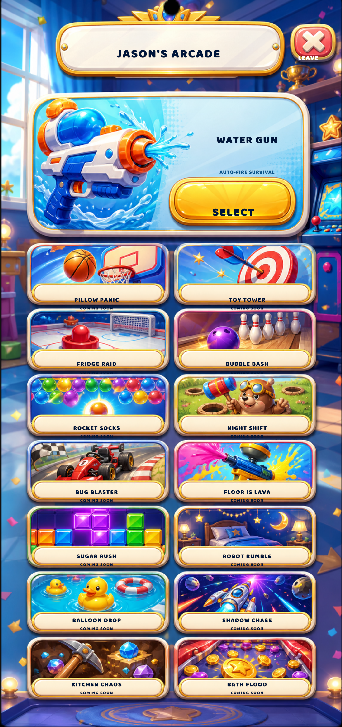
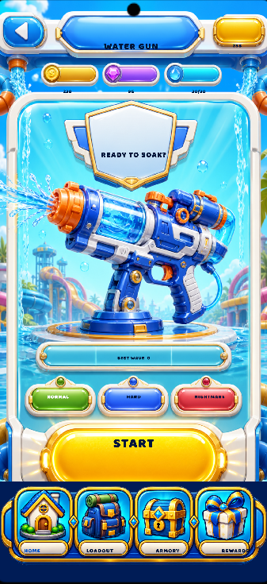
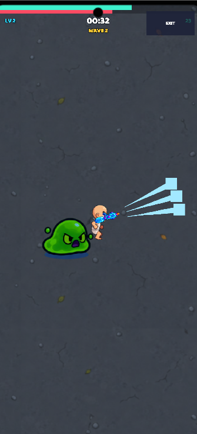
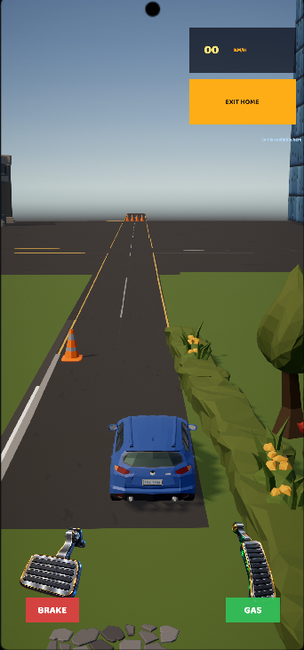
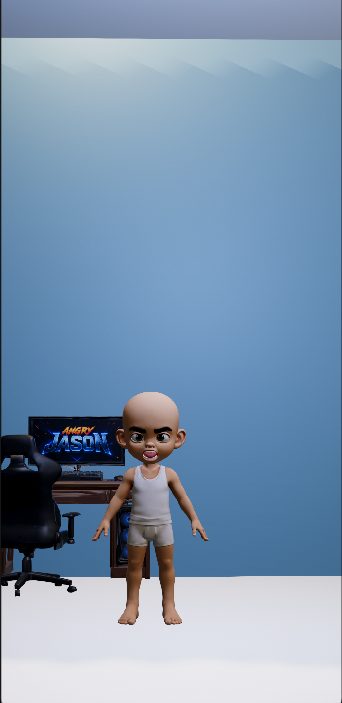
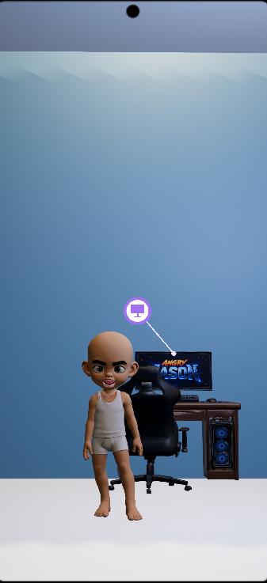

# Angry Jason

> A stylized virtual pet mobile game prototype built in Unity.

**Status:** Prototype / In Active Development  
**Engine:** Unity  
**Platform:** Mobile  
**Developer:** Solo Developer

## Current Features

- Interactive 3D character
- Character reactions and emotions
- Mobile UI
- Minigame systems
- Character customization concepts
- Progression systems

## Tech Stack

- Unity
- C#
- Cinemachine
- Unity Animation Rigging
- Mobile UI

## Screenshots Angry Jason

## Screenshots Angry Jason

